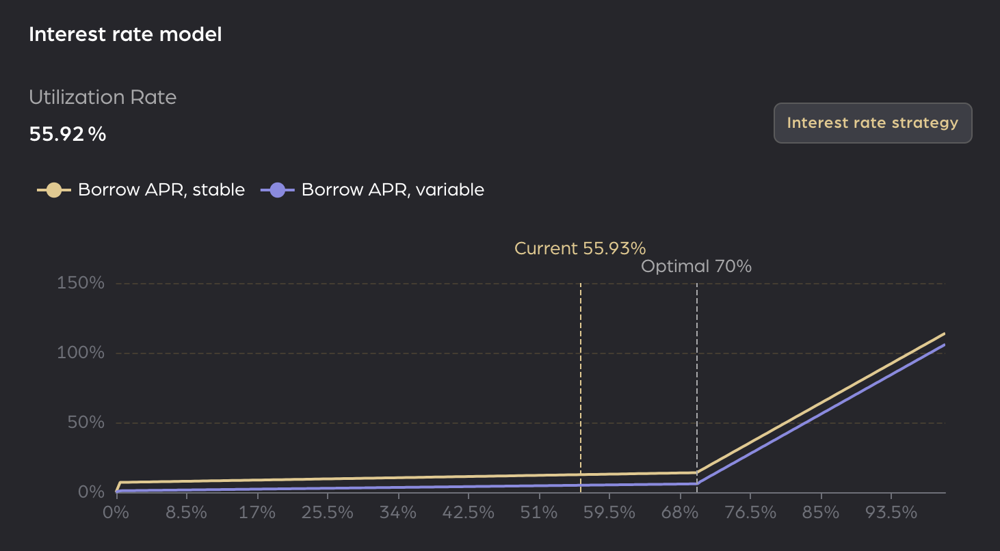

## Simple Summary

If you can't explain it simply, you don't understand it well enough. Provide a simplified and layman-accessible explanation of the HIP.

## Motivation

The motivation is critical for HIPs that want to change the HOPE Ecosystem's protocols. It should clearly explain why the existing protocol specification is inadequate to address the problem that the HIP solves. HIP submissions without sufficient motivation may be rejected outright.

## Specification

The technical specification should describe the syntax and semantics of any new feature.

## References

A list of relevant links like for this proposal e.g.

- [forum discussion](discordlink)
- [tests](githublink)
- [proposalCode](githublink)

## Copyright

Copyright and related rights waived via [CC0](https://creativecommons.org/publicdomain/zero/1.0/).